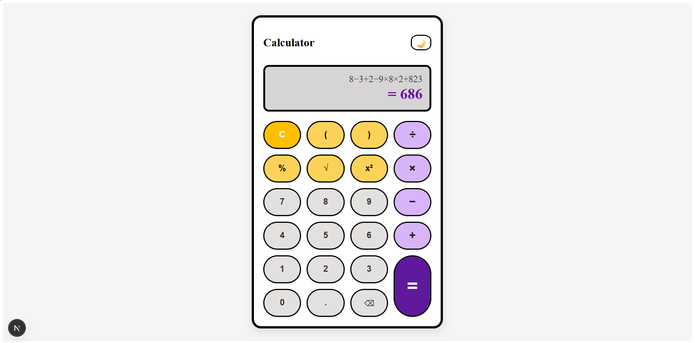
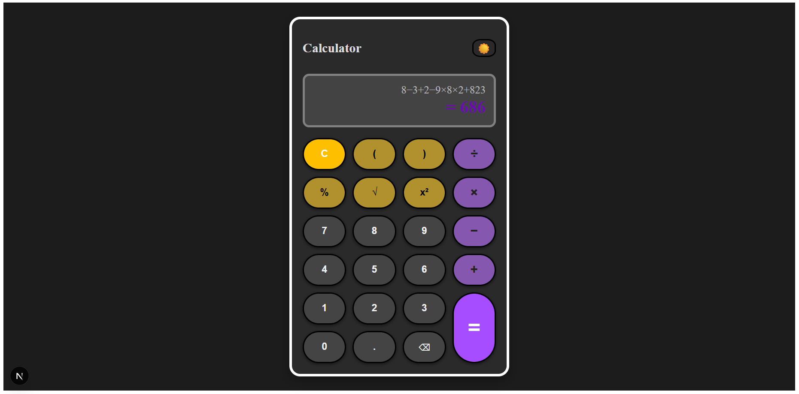

# 🧮 Modern Calculator (Light & Dark Mode)

A sleek, modern calculator built with **Next.js (React + TypeScript)** that supports both **light and dark themes**.  
This project is designed to feel intuitive for everyday use while also demonstrating clean UI/UX and responsive design principles.

---

## ✨ Features

- ✅ **Basic arithmetic operations** → Addition, Subtraction, Multiplication, Division  
- ✅ **Advanced operations** → Percentage (%), Square (x²), Square Root (√)  
- ✅ **Parentheses support** → Group expressions easily  
- ✅ **Clear & Backspace** → Reset or delete last entry  
- ✅ **Real-time evaluation** → Expressions are calculated instantly  
- ✅ **Light & Dark mode toggle** 🌙☀️  
- ✅ **Mobile-friendly design** → Works on desktops, tablets, and phones  

---

## 🎨 UI Preview

### 🔆 Light Mode

### 🌙 Dark Mode

